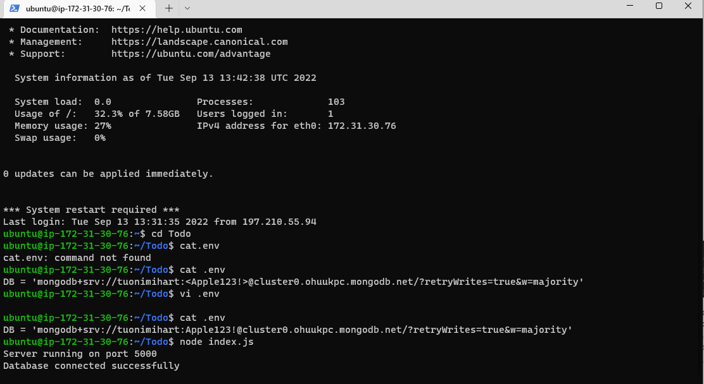

**PROJECT 3: MERN STACK IMPLEMENTATION**

 `SIMPLE TO-DO APPLICATION ON MERN WEB STACK`

- `STEP 1 – BACKEND CONFIGURATION`

`Successful installation of Nodejs and NPM `

`Installation of express js`

`Confirmation of port 5000 opened`

- `Confirmation of our backend fully configured`

- ` We use Postman to test our API`

- `Created a GET request to your API `

**STEP 2 – FRONTEND CREATION**

- `Confirmation of app running on localhost :3000`

- 	`Creating Our React Components and deploying our server`

- `Frontend Completed`

